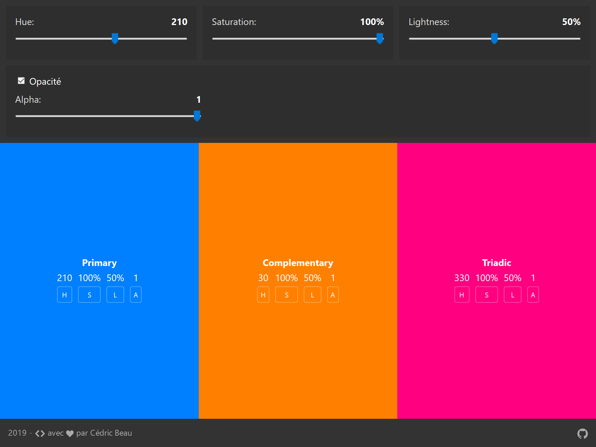
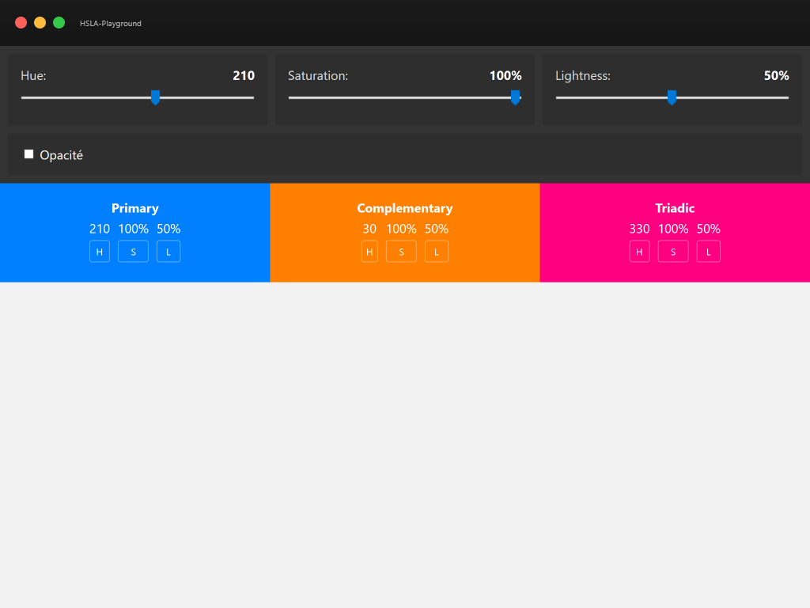
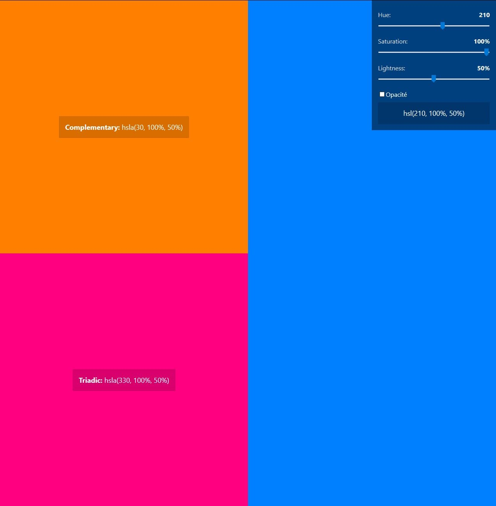
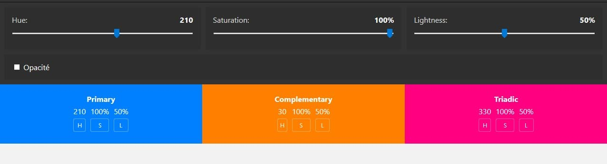

# hsla-playground

Outil en ligne pour générer une couleur HSLA

## Demo

[https://cedricbeau.github.io/hsla-playground/](https://cedricbeau.github.io/hsla-playground/)

**Mise à jour 25/04/2020**

* Remplacement des svg par la font icon Icomoon
* Refactorisation de l'architecture CSS

**Mise à jour 16/02/2019**

* Ajout du footer
* Ajout de la capture d'ecran

**Mise à jour 06/01/2019**

* Ajout de la capture d'ecran

**Mise à jour 08/12/2018**

* Remplacement du favicon

**Mise à jour 24/11/2018**

* Ajout du favicon
* HSLA Selector de vient HSLA Playground
* Passage de HSLA Playground en PWA

**Mise à jour 18/11/2018**

* Modification de la structure du selecteur d'opacité
* Diminution de l'opacité du background des des selecteurs
* Diminution du padding des résultats
* Ajout des screens **avant** et **arpès** modification du layout de la page

**Mise à jour 17/11/2018**

* Modification du layout de la page
* modification du rendu pour chaque résultat - remplacement de hsl(valeur, valeur, valeur) par:

|| couleur ||
| :----: | :----: | :----: |
| valeur | valeur | valeur |
| def |def | def |

**avant**

**après**

**Mise à jour 24/10/2018**

* Ajout de l'option Opacité
* Ajout de onchange="" pour le support de IE11

**Mise à jour 22/10/2018**

* Suppression du reset
* Ajout de la couleur complementaire
* Ajout de la couleur ternaire
